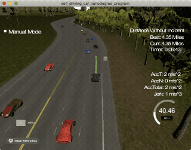
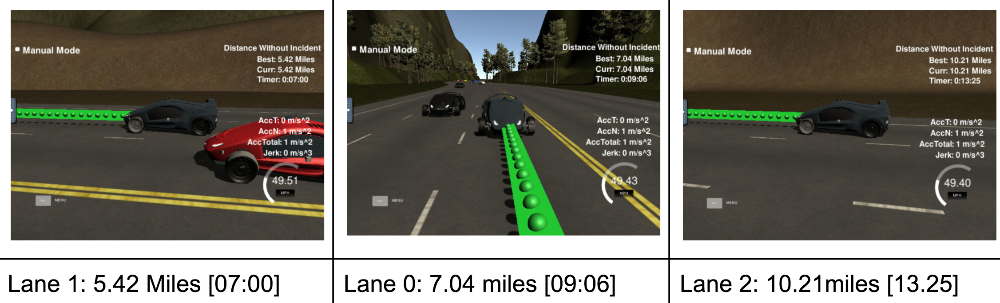

# Path Planning Project


### Driving Goals
The goal is to safely navigate around a virtual highway with other traffic that is driving +-10 MPH of the 50 MPH speed limit with given car's localization, sensor fusion data, and a sparse map list of waypoints around the highway. 
The car should try to go as close as possible to the 50 MPH speed limit, which means passing slower traffic when possible while other cars change lanes too. The car should avoid hitting other cars at all cost as well as driving inside of the marked road lanes at all times, unless going from one lane to another. The car should be able to make one complete loop around the 6946m(4.32 miles) highway. Since the car is trying to go 50 MPH, it should take a little over 5 minutes to complete 1 loop. Also the car should not experience total acceleration over 10 m/s^2 and jerk that is greater than 10 m/s^3.

#### The map of the highway is in data/highway_map.txt
Each waypoint in the list contains  [x,y,s,dx,dy] values. x and y are the waypoint's map coordinate position, the s value is the distance along the road to get to that waypoint in meters, the dx and dy values define the unit normal vector pointing outward of the highway loop.
The highway's waypoints loop around so the frenet s value, distance along the road, goes from 0 to 6945.554 (4.31576 miles)

#### Data Detail
* ["x"] The car's x position in map coordinates
* ["y"] The car's y position in map coordinates
* ["s"] The car's s position in frenet coordinates
* ["d"] The car's d position in frenet coordinates
* ["yaw"] The car's yaw angle in the map
* ["speed"] The car's speed in MPH
* ["previous_path_x"] The previous list of x points previously given to the simulator
* ["previous_path_y"] The previous list of y points previously given to the simulator
* ["end_path_s"] The previous list's last point's frenet s value
* ["end_path_d"] The previous list's last point's frenet d value
* ["sensor_fusion"] A 2d vector of cars
* car's [unique ID, x position in map coordinates, y position in map coordinates, x velocity in m/s, y velocity in m/s, s position in frenet coordinates, d position in frenet coordinates]

## Result

1. The car is able to drive more than 10 miles for 13 min with no incidents
2. The car drives according to the speed limit.
- The car doesn't drive faster than the speed limit (50MPH)
3. Max Acceleration and Jerk are not Exceeded.
- The car does not exceed a total acceleration of 10 m/s^2 and a jerk of 10 m/s^3.
4. No collisions
5. The car stays in its lane, except for the time between changing lanes.
  

### Implementation Approach
### Dynamic Lane Change
There are only three lanes (0, 1, 2) so that starting from middle lane (lane ==1) thre are 3 states are considered; KL(keep the lane), just keep lane (KL), lane change to the right(LCR) or lane change to the left (LCL)
* the car stays in lane 0-3 only by checking on each of d value (sensor_fustion[*][6])
    * 0 <d<4 :lane 0
    * 4<d<8: lane 1
    * 8<d<12: lane 12
* IF Car Ahead
    * IF there is NO car on the left lane AND ego car is NOT on the left lane
        * Change lane to left
        * ELSE IF there is NO car on the right lane AND ego car is NOT on the right lane
            * Change lane to right
        * ELSE
            * Reduce Acceleration
* ELSE
    * IF ego car is NOT on the center lane
        * IF ego car is on the left lane AND there is NO car on the right    OR    ego car is on the right lane AND     there is NO car on the left
            * Go back to the center lane
    * IF Reference Velocity is LESS THAN Max Speed
        * Increase Acceleration

### Prediction from sensor_fusion and Behavior
* estimate car's s position: check_car_s
* check if there is car in front of current car with 30 meters
* if car is ahead within 30min range
    * move to the left: when no car in the left lane within 30meter range no more than lane =0
    * or move to the right: when no car in the left lane within 30meter range no more than lane=2
    * or decrease car speed  0.224-- in the current lane
* no car ahead
    * when no car ahead, keep the car in the middle ; move the car to the middle lane if the car is running at lane 0 or 2.
    * increase speed 0.224++

### Dynamic Speed adjustment
- Initialized Max Speed 49.5
- When the car's speed approaches to the spped limit, I set the car speed to MAX_SPEED = 49.5
- Initialized Acceleration to .224
- When the car's exceleration apporached to the limit , set to MAX_ACC = .224
- to avoid collison, set the safe distance =30.0 as a target distance, calcuate distance y position on 30m ahead when changing lanes (main.cpp)
Dynamic speed adjustment by updating the speed based on if there is a vehicle ahead or not (explained aove)
the speed should increase/decrease by 0.224 while keeping a check that it should not exceed 49.5 mph.
The car drove smoothly by not violating the total acceleration of 10 m/s^2 and max jerk of 10 m/s^3. Nice work.
The vehicle slows down if there is a vehicle in front and it is not possible to change lane which makes sure that there is no collision with other vehicles. Also, the vehicle prefers to drive in the middle lane if it is available.
If there is a slower vehicle ahead then the car changes the lane smoothly. The car also correctly predicts if the adjacent lanes are available to drive by using the sensor fusion data and only then changes the lane thus avoiding collision with the vehicles in the adjacent lanes.

### sensor_fusion
the position and velocity information of the nearby vehicles
The sensor fusion data received from the simulator in each iteration is parsed and trajectories for each of the other cars on the road are generated. These trajectories match the duration and interval of the ego car's trajectories generated for each available state and can be use in conjunction with a set of cost functions to determine a best trajectory for the ego car.

### Spline ("spline.h")
Instead of generating polynomial trajectory, to create smoother trajectory , I used Spline (http://kluge.in-chemnitz.de/opensource/spline/). ("spline.h" a single hearder file is included)

### Trajectory ()
Used the last two points from previous path points that makes path tangent to the car (when less than two previous data, if previous size is almost empty use the car as starting reference) and intialized spline calculation. Created a list of evenly(30m) speaced (x,y) way points and interpolated these waypoints with a spline.  The coordinates were  transformed to the local car coordinates by shifting and rotating. Trajectory is generated based on the speed, lane output , car coordinates and past path points. for smooth trasnsition, added previous path points , start with all of the previous path points from last time
, the pass trajectory points are copied to the new trajectory,

#### Frenet Coordinates
"Frenet Coordinates", which are a way of representing position on a road in a more intuitive way than traditional (x,y) Cartesian Coordinates.
the variables s and d to describe a vehicle's position on the road. The s coordinate represents distance along the road (a.k.a longitudinal displacement) and the d coordinate represents side-to-side position on the road (a.k.a lateral displacement).

---

## Dependencies
* gcc/g++ >= 5.4
* [Eigen](http://eigen.tuxfamily.org/.) : C++ template library for linear algebra: matrices, vectors, numerical solvers, and related algorithms.
* [uWebSockets](https://github.com/uWebSockets/uWebSockets)
* [Term3 Simulator](https://github.com/udacity/self-driving-car-sim/releases/tag/T3_v1.2)
To run the simulator on Mac/Linux, first make the binary file executable with the following command:
```shell
sudo chmod u+x {simulator_file_name}
```

### Code Style
[Google's C++ style guide](https://google.github.io/styleguide/cppguide.html).


